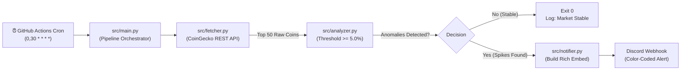

# 🐕 Volatility & Anomaly Spike Watchdog

[](https://github.com/achmadsoewrdi/volatility-spike-watchdog/actions/workflows/watchdog.yml)
[](https://www.python.org/downloads/)
[]()
[](LICENSE)

An **unattended, event-driven serverless automation pipeline** that continuously monitors the **Top 50 cryptocurrency market movements** every 30 minutes. It detects hourly volatility anomalies ($\ge 5.0\%$) and dispatches structured **Discord Rich Embed alerts** without any human intervention.

Built for **Track 02 — Automation & Workflows (Sectors Hackathon 2026)**.

---

## 🎯 Architecture & Data Flow

The system adheres strictly to the **Single Responsibility Principle (SRP)** and **12-Factor App methodology**, decoupling network I/O, pure business logic, and presentation formatting into isolated modules.



---

## ✨ Key Engineering Highlights

* **100% Unattended (Zero-Maintenance):** Operates 48 times a day entirely serverless on GitHub Actions Ubuntu runners. No dedicated VPS or local machine required.
* **Noise Reduction Filter (0% False Positives):** Suppresses spam during stagnant market conditions; alerts are dispatched only when 1-hour price fluctuations touch or exceed **5.0%**.
* **Defensive Programming & Null-Safety:** Resilient against API rate limits (`HTTP 429`), server errors (`HTTP 5xx`), and missing/null percentage data without pipeline crashes.
* **Dynamic Visual Presentation:** Discord Rich Embeds automatically adapt colors based on market sentiment:
  * 🟢 **Green (`#00FF00`)** when positive anomalies (*pumps*) dominate.
  * 🔴 **Red (`#FF0000`)** when negative anomalies (*drops*) dominate.
* **100% Traceability:** Detailed execution logs with ISO UTC timestamps are permanently preserved in GitHub runner history for judging verification.

---

## 📂 Project Structure

```text
volatility-spike-watchdog/
├── .github/workflows/
│   └── watchdog.yml          # Serverless Cron Runner (0,30 * * * *)
├── src/
│   ├── config.py             # Centralized settings & fail-fast validator
│   ├── fetcher.py            # CoinGecko REST client with error guards
│   ├── analyzer.py           # Pure logic anomaly detector & sentiment
│   ├── notifier.py           # Discord Rich Embed builder & HTTP dispatcher
│   └── main.py               # Pipeline orchestrator
├── tests/
│   ├── test_analyzer.py      # Unit tests for filter math & null tolerance
│   └── test_notifier.py      # Unit tests for embed styling & limits
├── .env.example              # Configuration template
├── requirements.txt          # Production dependencies (requests, python-dotenv)
├── requirements-dev.txt      # Development dependencies (pytest)
└── README.md                 # Project documentation
```

---

## 🚀 Getting Started (Local Setup)

### 1. Clone Repository & Setup Virtual Environment
```bash
git clone https://github.com/achmadsoewrdi/volatility-spike-watchdog.git
cd volatility-spike-watchdog

python3 -m venv .venv
source .venv/bin/activate
pip install -r requirements-dev.txt
```

### 2. Configure Environment Variables
Copy the template and provide your Discord Webhook URL:
```bash
cp .env.example .env
```
Edit `.env`:
```ini
DISCORD_WEBHOOK_URL=https://discord.com/api/webhooks/your_webhook_id/your_webhook_token
```

### 3. Run Automated Tests
Verify business logic and embed formatting locally:
```bash
pytest -v
```

### 4. Run Pipeline Manually
```bash
python -m src.main
```

---

## ☁️ Cloud Deployment (GitHub Actions)

To deploy this automation on your own GitHub account:

1. **Fork or Push** this repository to GitHub.
2. Navigate to **Settings > Secrets and variables > Actions**.
3. Create a **New repository secret**:
   * **Name:** `DISCORD_WEBHOOK_URL`
   * **Value:** Your Discord Webhook URL.
4. Go to the **Actions** tab, select **Market Volatility Watchdog**, and click **Run workflow** to test execution. The cron job will automatically run every 30 minutes thereafter.

---

## 🔒 Security & Privacy

In compliance with **OWASP A02 (Security Misconfiguration & Sensitive Data Exposure)**:
* Webhook URLs are never hardcoded and strictly managed via environment variables and GitHub Secrets.
* Local credentials (`.env`) and virtual environments (`.venv/`) are blacklisted in `.gitignore`.

---

## 👤 Author

* **Achmad Soewardi** — Hackathon Participant
* Target Track: **Track 02 - Automation & Workflows (Sectors Hackathon 2026)**

